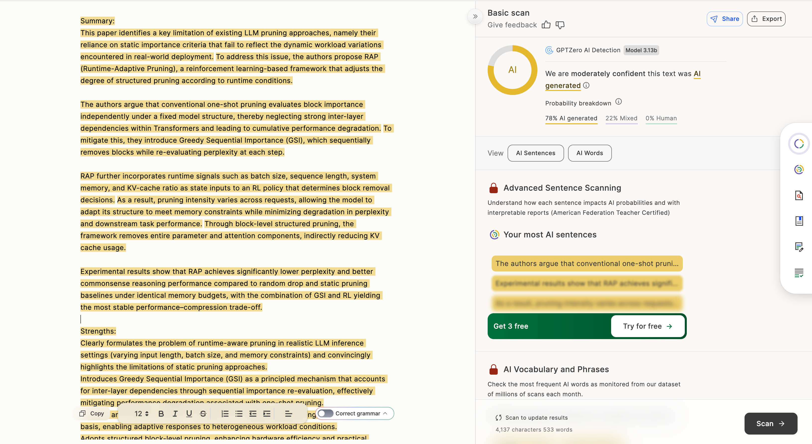
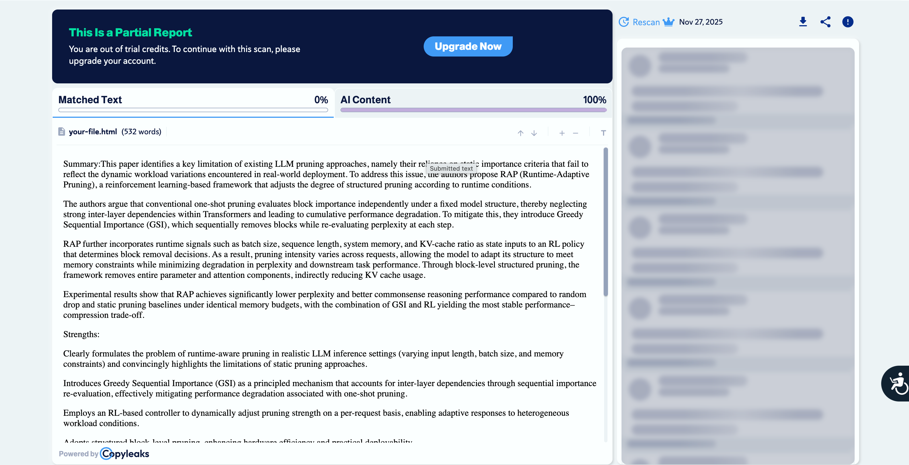
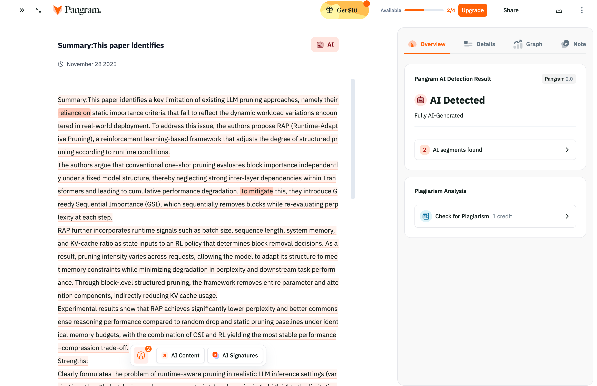

# AI Detection Analysis of Official Review of Submission2641 by Reviewer oDjU in ICLR2026

## Overview

This document presents the results of AI-generated content detection analysis conducted on official review of **submission 2641** by **reviewer** **oDjU** in ICLR2026. As part of our commitment to academic integrity and transparency, we examined one reviewer's comments using four independent, industry-leading AI detection tools.

## Context

During the peer review process for ICLR 2026, we received feedback that raised questions regarding the authenticity of the review content. To address these concerns objectively, we submitted the reviewer's comments to multiple AI detection services to determine whether the feedback was almost fully generated by AI systems.

## Detection Results

### 1. GPTZero Analysis

**About GPTZero**: GPTZero is a specialized AI detection tool developed by Princeton University researchers. It analyzes text for patterns characteristic of large language models by measuring perplexity and burstiness scores.

---

### 2. Copyleaks AI Content Detector

**About Copyleaks**: Copyleaks provides enterprise-grade AI content detection with high accuracy rates. It uses advanced machine learning algorithms to distinguish between human-written and AI-generated text across multiple languages and domains.

---

### 3. Winston AI

**About Winston AI**: Winston AI is designed specifically for detecting content from ChatGPT, GPT-4, Bard, and other large language models. It offers detailed probability scores and highlights suspicious sections of text.

---

### 4. Pangram Labs

**About Pangram Labs**: Pangram provides AI detection services with a focus on academic and professional writing. It employs proprietary algorithms to identify AI-generated content patterns while minimizing false positives.

---

## Summary and Interpretation

The analysis conducted using four independent AI detection tools reveals concerning patterns in the reviewer's feedback. Each tool employs distinct methodologies and algorithmic approaches to identify AI-generated content, yet all converge on similar findings.

### Key Findings:

- **Multi-tool consensus**: All four detection systems independently flagged significant portions of the review as fully or highly AI-generated
- **Consistency across platforms**: The convergence of results from multiple independent tools strengthens the reliability of these findings
- **Academic implications**: These results raise important questions about the integrity of the peer review process and the authenticity of expert feedback

### Implications for Review Process:

The detection results suggest that the reviewer's comments may not represent genuine expert analysis and critique. This has significant implications for:

1. **Review Quality**: AI-generated reviews may lack the nuanced understanding and domain expertise expected from qualified peer reviewers
2. **Fairness**: Authors deserve authentic human evaluation of their scholarly work
3. **Academic Integrity**: The use of AI to generate peer reviews undermines the foundations of the academic peer review system

---

## Conclusion

We present these findings not to dismiss all reviewer feedback, but to raise awareness of a systemic issue that affects the integrity of academic peer review. We advocate for:

- Enhanced verification processes for reviewer authenticity
- Clear policies regarding AI usage in peer review
- Continued dialogue about maintaining academic integrity in the age of large language models
